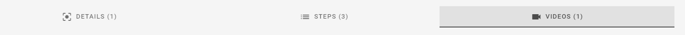
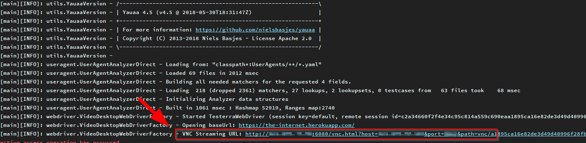

# Testerra Selenoid Connector

<p align="center">
    <a href="https://mvnrepository.com/artifact/io.testerra/selenoid-connector" title="MavenCentral"></a>
    <a href="/../../commits/" title="Last Commit"></a>
    <a href="/../../issues" title="Open Issues"></a>
    <a href="./LICENSE" title="License"></a>
</p>

<p align="center">
  <a href="#setup">Setup</a> •
  <a href="#documentation">Documentation</a> •
  <a href="#support-and-feedback">Support</a> •
  <a href="#how-to-contribute">Contribute</a> •
  <a href="#contributors">Contributors</a> •
  <a href="#licensing">Licensing</a>
</p>

## About this module

This module provides additional features for [Testerra Framework](https://github.com/telekom/testerra) for automated tests.

Using a Selenium Grid based on [Selenoid](https://github.com/aerokube/selenoid) this module provides access to videos and VNC
streams. When activated, video files are automatically added to the Testerra report. 

The module will register automatically by using `ModuleHook`.

## Setup

### Requirements

| Selenoid connector   | Testerra      |
| -------------------- | --------------|
| `1.0-RC-13`          | ` 1.0-RC-32`  |
| `1.0-RC-14`          | ` 1.0-RC-34`  |
| `1.0.0`              | ` 1.0.0`      |
| `>= 1.1`             | `>= 1.1`      |

You need at least Selenoid 1.10.1 or above.

### Usage

Include the following dependency in your project.

Gradle:

````groovy
implementation 'io.testerra:selenoid-connector:1.2'
````

Maven:

````xml

<dependency>
    <groupId>io.testerra</groupId>
    <artifactId>selenoid-connector</artifactId>
    <version>1.2</version>
</dependency>
````

## Documentation

### Video support

The Selenoid connector can collect the generated video stream and provide it for the Testerra report.

*Activate the video screencaster*

````
# test.properties
# activate generation of screencast in general, default = false
tt.screencaster.active=true
# activate appending of screencast to report for failed tests, default = true
tt.screencaster.active.on.failed=true
# activate appending of screencast to report for successful tests, default = false
tt.screencaster.active.on.success=true
````

After finishing the test run the connector collects the video files and adds them to the report.

*You will find all video files in the method detail view in a separate tab.*



> IMPORTANT: By default only video files of failed methods will be added.

### VNC support

For debugging you tests in a Selenoid grid you can activate the support for linking the VNC streaming URL. As VNC client we are
using [noVNC](https://github.com/novnc/noVNC).

*Setup a noVNC server*

* Please not that your Grid must be available by your noVNC client.
* We prefer to use one the many Docker images available at https://hub.docker.com/.

*Configure your `test.properties` file*

````
# test.properties
tt.selenoid.vnc.enabled=true
tt.selenoid.vnc.address=http://<your-no-vnc-client>:<port>/vnc.html
````

*Start your test locally*

Starting your test in your local IDE you will find the VNC client URL in the log messages. The URL can only be generated if a
browser session was started successfully.

Some IDEs mark the URL as clickable link.


### Use other Selenoid features

#### Download files from browser

Selenoid supports to download files your browser downloaded before from a site.

````java
SessionContext currentSessionContext = ExecutionContextController.getCurrentSessionContext();
String path = SelenoidHelper.get().getRemoteDownloadPath(currentSessionContext, "filename.jpg");
// Path contains something like http://my.selenoid.host:4444/download/<sessions-id>/filename.jpg
````

More details: https://aerokube.com/selenoid/latest/#_downloading_files_from_browser

#### Accessing clipboard

Selenoid can returns the content of the clipboard of your browser session.

´´´´java
SessionContext currentSessionContext = ExecutionContextController.getCurrentSessionContext();
String clipboard = SelenoidHelper.get().getClipboard(currentSessionContext);
´´´´

More details: https://aerokube.com/selenoid/latest/#_accessing_clipboard

#### Set browser language and locale

Sometimes you want to start your browser with a specific language / locale setting to test your websites in different language /
locales. `Selenoid` can handle environment variables passed via the `DesiredCapabilities`. 

More details: https://aerokube.com/selenoid/latest/#_per_session_environment_variables_env

### Properties

|Property|Default|Description|
|---|---|---|
|tt.screencaster.active|true|All videos will be collected in failure case of test method and for exclusive sessions.|
|tt.screencaster.active.on.success|false|When true, generated video files will be attached the report for successful test methods|
|tt.screencaster.active.on.failed|true|Generated video files will be attached the report for failed test methods|
|tt.selenoid.vnc.enabled|true|VNC Stream will be activated and logged to the console.|
|tt.selenoid.vnc.address|none|VNC Host address - Will be used to generate a unique url for accessing the VNC session. <br> For a hosted [noVNC server](https://github.com/novnc/noVNC) this should be `http://<host>:<port>/vnc.html`.|

### Additional information

The Selenoid connector adds some additional information to the new browser session. It uses the ``label`` capability to mark the session with the following information if available:

|Label|Description|
|---|---|
| ReportName | Contains the Testerra report name |
| RunConfig | Contains the Testerra run configuration |
| Testmethod | Contains the current TestNG test method name |

This feature is mentioned here: [https://aerokube.com/selenoid/latest/#_container_labels_labels](). 

### Troubleshooting

#### VNC url not displayed in my logfile

Please ensure that you setup up the `tt.selenoid.vnc.address` correctly, by using an url like
this `http://novnc-host:no-vnc-port/vnc.html`.

#### Videos not show up in report

Please ensure that you setup `tt.screencaster.active` and its related sub-properties for successful/failed methods properly.

#### I got the same video on multiple test methods

Congratulations. You're using exclusive WebDriver sessions. This is a feature from Testerra. One WebDriver session will be used
across multiple test methods until you close it. Because the generated video is valid for multiple test methods, we linked it for
you to all of them.

---

## Publication

This module is deployed and published to Maven Central. All JAR files are signed via Gradle signing plugin.

The following properties have to be set via command line or ``~/.gradle/gradle.properties``

| Property                      | Description                                         |
| ----------------------------- | --------------------------------------------------- |
| `moduleVersion`               | Version of deployed module, default is `1-SNAPSHOT` |
| `deployUrl`                   | Maven repository URL                                |
| `deployUsername`              | Maven repository username                           |
| `deployPassword`              | Maven repository password                           |
| `signing.keyId`               | GPG private key ID (short form)                     |
| `signing.password`            | GPG private key password                            |
| `signing.secretKeyRingFile`   | Path to GPG private key                             |

If all properties are set, call the following to build, deploy and release this module:
````shell
gradle publish closeAndReleaseRepository
````

## Code of Conduct

This project has adopted the [Contributor Covenant](https://www.contributor-covenant.org/) in version 2.0 as our code of conduct. Please see the details in our [CODE_OF_CONDUCT.md](CODE_OF_CONDUCT.md). All contributors must abide by the code of conduct.

## Working Language

We decided to apply _English_ as the primary project language.  

Consequently, all content will be made available primarily in English. We also ask all interested people to use English as language to create issues, in their code (comments, documentation etc.) and when you send requests to us. The application itself and all end-user faing content will be made available in other languages as needed.

## Support and Feedback

The following channels are available for discussions, feedback, and support requests:

| Type                     | Channel                                                |
| ------------------------ | ------------------------------------------------------ |
| **Issues**   | <a href="/../../issues/new/choose" title="Issues"></a> |
| **Other Requests**    | <a href="mailto:testerra@t-systems-mms.com" title="Email us"></a>   |

## How to Contribute

Contribution and feedback is encouraged and always welcome. For more information about how to contribute, the project structure, as well as additional contribution information, see our [Contribution Guidelines](./CONTRIBUTING.md). By participating in this project, you agree to abide by its [Code of Conduct](./CODE_OF_CONDUCT.md) at all times.

## Contributors

At the same time our commitment to open source means that we are enabling -in fact encouraging- all interested parties to contribute and become part of its developer community.

## Licensing

Copyright (c) 2021 Deutsche Telekom AG.

Licensed under the **Apache License, Version 2.0** (the "License"); you may not use this file except in compliance with the License.

You may obtain a copy of the License at https://www.apache.org/licenses/LICENSE-2.0.

Unless required by applicable law or agreed to in writing, software distributed under the License is distributed on an "AS IS" BASIS, WITHOUT WARRANTIES OR CONDITIONS OF ANY KIND, either express or implied. See the [LICENSE](./LICENSE) for the specific language governing permissions and limitations under the License.
